<p align="center">
  
</p>

<p align="center"><strong>Your agents can keep moving. Your surface stays calm.</strong></p>

<p align="center">
  <a href="https://github.com/Cod-Hash-Studios/nagi/actions/workflows/ci.yml"></a>
  <a href="LICENSE"></a>
  
  
</p>

<p align="center">
  <a href="#why-nagi">Why Nagi</a> ·
  <a href="#what-is-already-here">What works</a> ·
  <a href="#try-it-from-source">Build it</a> ·
  <a href="#the-honest-status">Status</a> ·
  <a href="CONTRIBUTING.md">Contribute</a>
</p>

<p align="center">
  
</p>

Nagi is a terminal-native mission runtime for coding agents. It gives work an
objective, a claimed Git checkout, a durable trail, and a definition of done
that can survive the agent that started it.

It is not a graphical chat client. It is not another dashboard you have to keep
open. It lives in the terminal you already use.

> [!IMPORTANT]
> Nagi is under active development and currently ships from source only. There
> is no signed public release channel yet. Self-update, remote binary download,
> and publishing workflows stay disabled until their security review is done.

## Why Nagi

Starting more agents is easy. Staying oriented is the hard part.

Which agent owns which checkout? What was it actually asked to finish? Is it
working, waiting, or blocked on a decision? Did the tests pass before or after
the last edit? Can you close the work with evidence, or only with a confident
sentence from a model?

Most terminal multiplexers show processes. Nagi is being built to show intent.

| A pane can tell you | A Nagi mission adds |
|---|---|
| what is running | what outcome was requested |
| what the process printed | what needs your attention |
| whether the process exited | whether the closure checks are fresh |
| where the shell is | which worktree the run owns |
| what happened recently | a durable, replayable mission journal |

<p align="center">
  
</p>

## What is already here

### A terminal workspace that feels current

One Rust binary. No Electron. Persistent sessions, panes, tabs, workspaces,
mouse resizing, keyboard control, SSH-friendly detach and reattach, and a Unix
socket API for automation.

You should not need to memorize tmux before you can keep several agents tidy.
Use the mouse when it is faster. Use the keyboard when you know exactly where
you want to go.

### Missions that survive the happy path

A mission binds together:

- a human-readable objective;
- explicit acceptance criteria;
- an immutable closure plan;
- one canonical Git checkout and an exclusive run lease;
- an append-only journal with snapshots and crash recovery;
- attention events that are recorded before a response is acknowledged;
- proof that is tied to the workspace state it verified.

The journal is single-writer. Runtime directories and records use private Unix
permissions. Symlinked or weakly protected state is rejected instead of quietly
trusted.

### Managed coding-agent adapters

Nagi speaks to coding agents through typed adapters, then normalizes their very
different protocols into one mission model.

| Agent | Terminal workspace | Managed actor | Mission start |
|---|:---:|:---:|:---:|
| Codex | yes | tested | read-only start wired |
| Claude Code | yes | tested | read-only start wired |
| OpenCode | yes | tested | wiring in progress |

The OpenCode actor has its own authenticated loopback lifecycle, SSE limits,
deduplication, permission handling, resume logic, and failure tests. Nagi does
not label that path complete until `mission.start` exposes it end to end.

### Proof, not vibes

The closure engine can map every acceptance criterion to command or manual
checks. Evidence is bound to the relevant files, base tree, result tree, diff,
artifacts, and timestamps. If the workspace changes, stale proof stops being
proof.

Checks currently run with the user's operating-system permissions. They are
trusted commands, not a security sandbox.

## Try it from source

The mission runtime currently targets Unix systems. You need Rust 1.96.1 and
Zig 0.15.2 to build Nagi.

```bash
git clone https://github.com/Cod-Hash-Studios/nagi.git
cd nagi

zig version  # must print 0.15.2
cargo build --release --locked
./target/release/nagi
```

Nagi uses isolated config and runtime paths. It does not reuse Herdr sockets,
sessions, logs, or environment variables.

To inspect the live API contract:

```bash
./target/release/nagi api schema
./target/release/nagi api schema --json
./target/release/nagi api snapshot
```

<details>
<summary><strong>Wire-format example for socket clients</strong></summary>

```json
{
  "id": "mission-create-1",
  "method": "mission.create",
  "params": {
    "mission_id": "login-redirect",
    "title": "Preserve the login redirect",
    "repository_path": "/home/me/project",
    "objective": "Return users to the page they requested after login.",
    "acceptance_criteria": [
      "The redirect integration test passes",
      "An invalid redirect cannot leave the application origin"
    ]
  }
}
```

The next step is `mission.configure`, where every criterion is covered by a
required command or manual check. The generated schema is committed at
[`docs/next/api/nagi-api.schema.json`](docs/next/api/nagi-api.schema.json).

</details>

## The honest status

This repository contains a serious foundation, not a finished public release.

| Surface | Status |
|---|---|
| Persistent terminal sessions and socket API | working |
| Durable mission create, list, get, and configure | working |
| Worktree claims, journal replay, crash recovery, and handoff | working |
| Managed Codex and Claude Code start paths | working in read-only mode |
| Provider replies and workspace-write consent | in progress |
| Managed OpenCode actor | tested, start wiring pending |
| Full check execution and closure through the public API | in progress |
| Mission cockpit in the TUI | in progress |
| Live consent UI for provider questions and permissions | in progress |
| Signed binaries and release channel | intentionally blocked |

The first public release should make the whole loop feel obvious: define the
outcome, let agents work, answer only the decisions that matter, see fresh
evidence, close the mission, breathe.

## Under the surface

```text
terminal clients
      │
      ▼
single-writer Nagi server
      ├── panes, tabs, sessions, render streams
      ├── mission journal, snapshots, leases, attention
      ├── closure plan, evidence, proof
      └── managed provider adapters
             ├── Codex
             ├── Claude Code
             └── OpenCode
```

The TUI is a client of the runtime, not the owner of mission truth. That keeps
headless automation, SSH sessions, and future interfaces on the same durable
contract.

## Development

```bash
cargo fmt --check
cargo test --locked -- --test-threads=1
python3 -m unittest scripts.test_brand_isolation scripts.test_fork_safety
bun test src/integration/assets/nagi-agent-state.test.ts
```

Read [`AGENTS.md`](AGENTS.md) before changing runtime contracts and
[`CONTRIBUTING.md`](CONTRIBUTING.md) before opening a pull request.

## Provenance and license

Nagi is an independent derivative of
[Herdr](https://github.com/ogulcancelik/herdr), starting from `v0.7.4` at
commit `50aaa2ec046ee26ff407c20f49de496f522512a8`. The complete upstream Git
history and required attribution are preserved. See [`FORK.md`](FORK.md).

Nagi is licensed under [`AGPL-3.0-or-later`](LICENSE). The separate commercial
license offered by the upstream project is not granted by this repository.

<p align="center">
  <strong>One mission. A calm surface.</strong><br />
  <sub>凪</sub>
</p>
