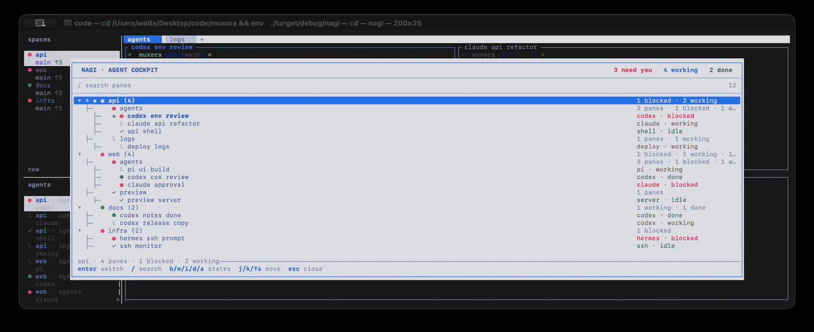

<p align="center">
  
</p>

<h3 align="center">Keep the agents running. See the one that needs you.</h3>

<p align="center">
  A fast, persistent terminal workspace for Codex, Claude Code, OpenCode, and the shells around them.
</p>

<p align="center">
  <a href="https://github.com/Cod-Hash-Studios/nagi/actions/workflows/ci.yml"></a>
  <a href="LICENSE"></a>
  
  
</p>

<p align="center">
  
</p>

<p align="center"><sub>Real Nagi build. Deterministic demo data. No mock interface.</sub></p>

Nagi is a native terminal multiplexer built for parallel coding agents. Your
panes keep running when the terminal disappears. Reattach locally, over SSH, or
from a phone. Press `Ctrl+B`, then `G`, to see what needs you and jump straight
to it.

| Stay running | See attention | Automate it |
|---|---|---|
| Persistent panes, tabs, and workspaces | Blocked, working, idle, and done at a glance | Typed CLI and Unix socket API |
| Detach and reattach over SSH | Search and filter every live agent pane | Durable mission journal and worktree claims |
| One Rust binary, no Electron | Mouse and keyboard navigation | Headless server for scripts and agents |

## Why Nagi

Starting agents is easy. Keeping track of them is not.

Nagi keeps real terminal processes, their current state, and the workspace they
own on one calm surface. It does not replace Codex, Claude Code, or OpenCode. It
gives them somewhere reliable to run.

## Works today

| Surface | Status |
|---|---|
| Persistent terminal sessions, splits, tabs, mouse, SSH reattach | working |
| Agent cockpit with search, state filters, counts, and direct switching | working |
| CLI and Unix socket API | working |
| Guided mission creation, recovery, journal replay, and worktree claims | working |
| Managed Codex, Claude Code, OpenCode, and local ACP launch | working |
| Fresh proof execution, portable evidence packs, and guarded closure | working |
| Project recipe setup/check/cleanup, port leases, health checks, restart adoption, exact cleanup, and mission wiring | working |
| Digest-bound provider handoff with same-mission continuation | working |
| Nagi Dawn/Night, theme files, and Ghostty theme import | working |
| Native plugins | working; explicit unrestricted trust required before enablement |
| Plugin v2 validation, grants, immutable locks, and WASI runtime | working for zero-capability components; requested host capabilities stay denied until approved |
| Public plugin registry | not available yet |
| Signed binaries and public release channel | not available yet |

The end-to-end mission loop is usable on the current development branch. Nagi
is still early access because the full plugin capability broker, distribution,
and the public release security gates are not finished.

## Agent compatibility

| Agent | Runs in Nagi | Managed mission path | Tested version |
|---|:---:|---|---:|
| Codex | yes | guided local launch, read-only socket launch | `0.144.5` |
| Claude Code | yes | guided local launch, read-only socket launch | `2.1.212` |
| OpenCode | yes | guided local launch, read-only socket launch | `1.18.3` |
| Any local ACP agent | yes | guided local launch after explicit write consent | contract v1 |

Any terminal program can run in a pane. Managed launches add a mission contract,
an isolated worktree, durable attention, and proof. The public socket cannot
approve workspace writes or answer permission prompts: those decisions stay
with the human in the local TUI. `nagi doctor` reports an installed provider as
ready only when its version matches the tested managed runtime above. Other
versions still run as ordinary terminal processes, but are not advertised as a
supported managed mission path.

For Codex and Claude Code, `nagi doctor --probe-providers` also performs the
real initialize handshake and exits before creating a thread or sending a user
turn. It verifies the installed protocol without spending a model turn.

## Build from source

The mission runtime currently targets Unix systems. You need Rust `1.96.1` and
Zig `0.15.2`.

```bash
git clone https://github.com/Cod-Hash-Studios/nagi.git
cd nagi

zig version  # 0.15.2
cargo build --release --locked
./target/release/nagi
```

Nagi uses its own config, runtime paths, sockets, logs, and environment
variables. It does not reuse an existing Herdr session.

## Start a mission

Check the machine, launch Nagi, then open the cockpit:

```bash
nagi doctor --probe-providers
nagi
```

Press `Ctrl+B`, then `G`, then `n`. The wizard asks for one outcome, explicit
acceptance criteria, a proof command, and a provider. Write access requires a
local confirmation and launches the provider inside an isolated Git worktree.
When `.nagi/project.toml` exists, the same confirmation screen lists its setup,
services, cleanup, and explicit file-copy scope before anything executes.

## Run the cockpit demo

Build Nagi, make sure `jq` is installed, then start an isolated development
server:

```bash
cargo run -- server
```

In another terminal:

```bash
scripts/seed_navigator_demo.sh
cargo run
```

Open the cockpit with `Ctrl+B`, then `G`. Use `b`, `w`, `i`, `d`, and `a` to
filter by state. The script inserts simulated status data into real Nagi
workspaces and panes, features only Codex and Claude as coding providers, and
refuses to touch the main socket unless explicitly allowed.

## API

```bash
nagi api schema
nagi api snapshot
nagi mission list
nagi mission get <mission-id>
nagi mission proof <mission-id>
nagi mission handoff <mission-id> --to claude-code --preview
nagi mission handoff <mission-id> --to claude-code --start --artifact-sha256 <sha256> --generated-at-millis <timestamp>
nagi mission close <mission-id>
nagi project detect . --json
nagi project validate .
nagi project setup . --yes
nagi project check . --yes
nagi project services start . --mission <mission-id> --run <run-id> --yes
nagi project resources preview
```

The generated mission schema lives at
[`docs/next/api/nagi-api.schema.json`](docs/next/api/nagi-api.schema.json).
Closing a mission always reruns its declared checks. Stored output alone is not
accepted as fresh proof.

## Make it yours

Start with Nagi Dawn or Nagi Night, load a theme file, or import colors from
Ghostty. Plugins can add actions, hooks, panes, and link handlers. Today those
plugins are native processes with resource limits and a scrubbed environment.
Nagi keeps them disabled until you explicitly grant unrestricted native trust;
legacy registry entries migrate to untrusted. Manifest v2 plugins run as WASI
components with bounded memory, fuel, output and wall time. They receive no
inherited filesystem, network or host environment access. Grants are
versioned, checksum-bound and revocable; capabilities without a host binding
remain unavailable even after approval.

<details>
<summary><strong>Architecture in 20 seconds</strong></summary>

```text
terminal clients
      │
      ▼
single-writer Nagi server
      ├── panes, tabs, sessions, render streams
      ├── mission journal, worktree claims, attention
      └── managed provider adapters
             ├── Codex
             ├── Claude Code
             ├── OpenCode
             └── local ACP agent
```

The TUI is a client of the server. Mission truth stays in the durable runtime,
so SSH clients, headless automation, and future interfaces share one contract.

</details>

## Contributing

Read [`AGENTS.md`](AGENTS.md) before changing runtime contracts and
[`CONTRIBUTING.md`](CONTRIBUTING.md) before opening a pull request.

```bash
cargo fmt --check
cargo test --locked -- --test-threads=1
python3 -m unittest scripts.test_brand_isolation scripts.test_fork_safety
bun test src/integration/assets/nagi-agent-state.test.ts
```

## Provenance

Nagi is an independent derivative of
[Herdr](https://github.com/ogulcancelik/herdr), starting from `v0.7.4` at
`50aaa2ec046ee26ff407c20f49de496f522512a8`. Required copyright and attribution
notices remain intact. See [`FORK.md`](FORK.md).

Nagi is licensed under [`AGPL-3.0-or-later`](LICENSE). The separate commercial
license offered upstream is not granted by this repository.

<p align="center">
  <strong>Less tab hunting. More finished work.</strong><br />
  <sub>凪</sub>
</p>
